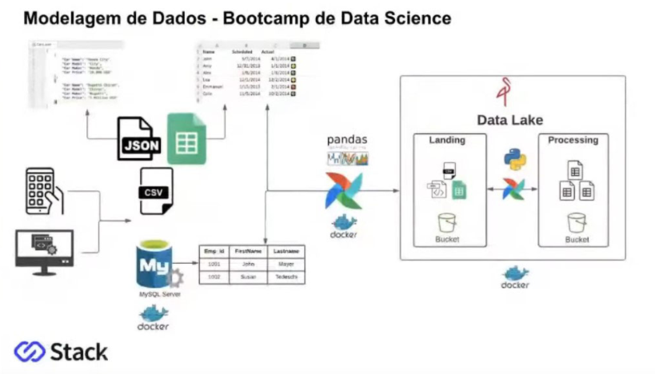
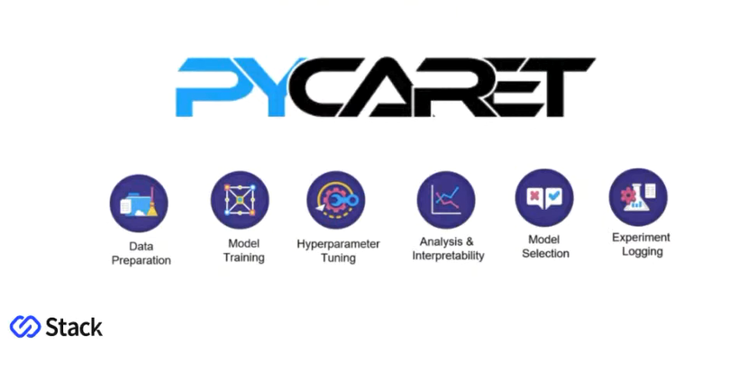

# Stack - Turnover Classifier

Tecnologias:

     
## 📃 Descrição do projeto
Nete projeto foi desenvolvido uma aplicação de Machine Learning para classificar os colaboradores de uma empresa, afim de identificar a saída e reter funcionários.

O projeto envolve **HR Analytics** e **Modelo de classificação**; sendo que foi desenvolvido durante um bootcamp de Ciência de Dados da [Stack Tecnologias](https://stacktecnologias.com.br/).

### Entendimento do negócio

A empresa deseja responder questões como:

* **Quais fatores influenciam para um colaborador deixar a empresa?**
* **Como diminuir o turnover?**
* **Podemos nos antecipar e saber se um determinado colaborador vai sair da empresa?**

### Etapas do projeto
- Data Mining com **MYSQL Server** e **Data Lake (Minio)**
- Automatização do Pipeline de dados com **Apache Airflow**
- Análise exploratória com **Python** e **Jupyter Notebook**
- Machine Learning com **AutoML - Pycaret**
- Criação do Data WebApp com **Streamlit**

### Dados da fonte

* **Banco de dados de produção**:
  * Tabela data de contratação, acidente de trabalho.
  * Tabela dados dos projetos de cada colaborador.
  * Tabela departamento, salário e Turnover.

## Data Pipeline

Foi criado um Pipeline de Dados com o orquestrador Airflow e o MYSQL Server, para que a extração dos dados possa ser feita de forma automática.

Os dados são extraídos do Data Lake e do banco de dados de produção. O objetivo do Data Lake é armazenar dados vindo de diversas fontes como CSV, XLSX e TXT. Todos os dados foram salvos no formato **Parquet** para facilitar a manipulação. 

Toda a transformação dos dados **(Data Cleaning/Transformation)** é realizada durante a extração, através do processo de ETL.

O Pipeline foi desenvolvido utilizando o orquestrador Airflow,tecnologia de container(Docker) e o Minio.

Visão geral do Pipeline:

Fonte Youtube: <a href="https://www.youtube.com/c/Stack_tecnologias">Stack</a>

## Resumo geral do projeto

### Análise Exploratória

Após a coleta dos dados foi feita a **Análise Exploratória dos Dados**, para resolver as principais dúvidas da empresa. Foram utilizadas técnicas de análise descritiva, análise univariáda e análise bivariada, para analisar variáveis categóricas e numéricas.

* **Insights principais:**
  * **Colaboradores com até 2 anos de empresa tedem a permanecer nela.**
  * **Colaboradores com notas medianas (entre 60 e 80), tendem a permanecer na empresa.**
  * **Porque colaboradores com satisfação baixa (0 a 20) e (20 a 50) deixam a empresa?(experiência ruim, salário, falta de crescimento, ambiênte)**
  * **Porque pessoas que recebem um aumento muito grande na avaliação tendem a deixar a empresa?**

### Machine Learning

Para criar o modelo supervisionado, foi realizado o processo de Machine Learning utilizando AutoML (Pycaret).

O pacote Pycaret oferece várias funções de Machine Learning, além de aumentar a produtividade do processo.

O melhor modelo escolhido foi o **Extra Trees Classifier**.

Visão geral do Pycaret:

Fonte Youtube: <a href="https://www.youtube.com/c/Stack_tecnologias">Stack</a>

### Deploy do Data App - Streamlit

Após a criação do modelo preditivo foi criado um Data App utilizando o Stremlit Share.